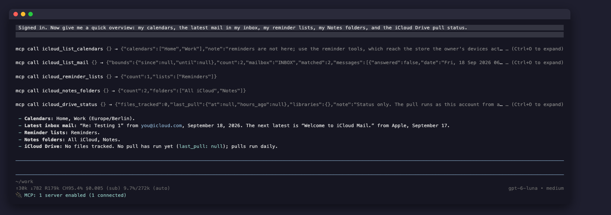
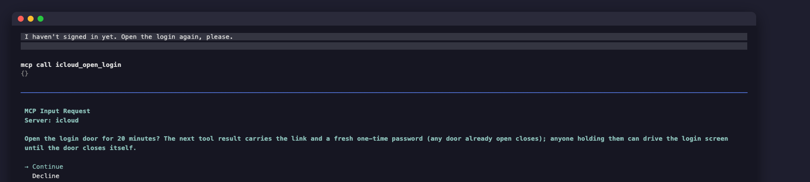
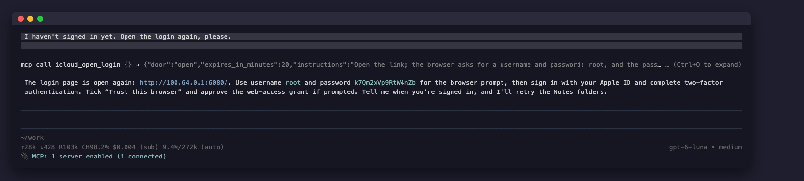
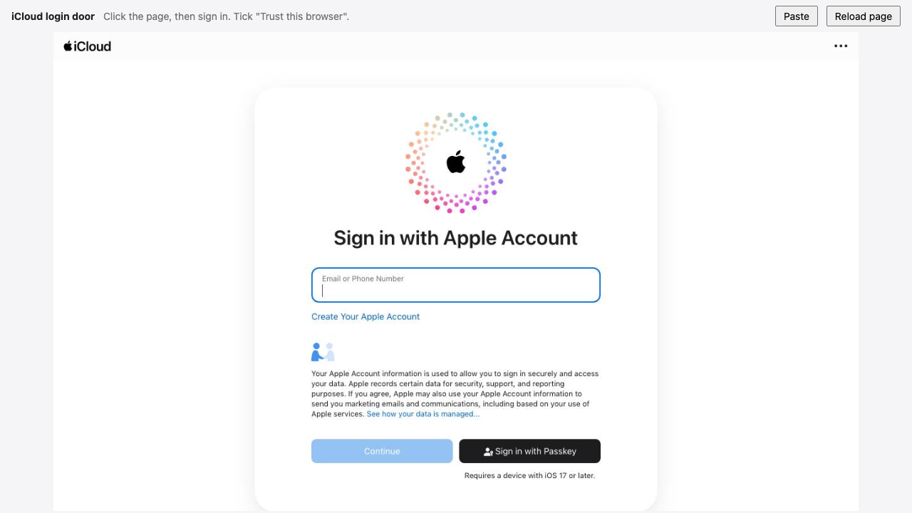
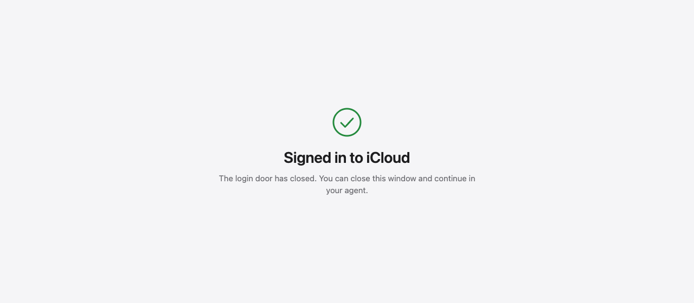

# iCloud Headless MCP

**Give any AI agent your iCloud: Calendar, Contacts, Mail, Notes, Reminders and Drive. One binary, a headless Chrome, two environment variables. No Mac required.**



Apple gives Notes and Reminders no API at all, and the parts that do have one are scattered across CalDAV, CardDAV and IMAP. So most iCloud automation quietly assumes a Mac on your desk running AppleScript. This server removes the Mac: calendar, contacts and mail go over the open protocols, and Notes and Reminders are driven through the real iCloud web apps in a headless Chrome that stays signed in. It runs on your laptop, a small VPS or a Raspberry Pi, and any MCP client that can spawn a process can use it.

- **32 tools, one server entry.** Read and write your calendar, search contacts, read and send mail, read and create notes, list and complete reminders, and check the iCloud Drive pull. [Full list below](#tools).
- **Two variables to configure.** Your Apple ID and an app-specific password. Everything else has a default.
- **Sign-in from your agent.** When the session needs a login, the agent hands you a one-time link to the headless browser. You sign in from any browser, the page tells you when you are done, and the agent carries on.
- **Safe writes.** Deletes, sent mail, note rewrites and anything that reaches other people ask you first, through the MCP client itself. Every Notes and Reminders write is checked against what the app shows, not assumed from a response code.

## Setup

### 1. Install

You need Google Chrome or Chromium on the machine (macOS finds `Google Chrome.app` by itself) and a Go toolchain:

```
go install github.com/sjdonado/icloud-headless-mcp/cmd/icloud-mcp@latest
```

That puts `icloud-mcp` in `$(go env GOPATH)/bin`. For an always-on Linux server with its own service account, use the [one-line installer](#run-it-on-a-server) instead.

### 2. Make an app-specific password

At [account.apple.com](https://account.apple.com), open **Sign-In and Security**, then **App-Specific Passwords**, and create one. It is revocable there at any time without touching anything else. Never use your primary Apple password.

### 3. Add it to your agent

The command is `icloud-mcp`, with your Apple ID and the app-specific password in its environment. Keep the tool timeout at 330 seconds or more: a Notes or Reminders call takes 60 to 90 seconds, and a cold app tab longer.

**pi** (with [pi-mcp-adapter](https://github.com/nicobailon/pi-mcp-adapter)), in `.mcp.json` or `~/.config/mcp/mcp.json`:

```json
{
  "mcpServers": {
    "icloud": {
      "command": "icloud-mcp",
      "env": { "ICLOUD_APPLE_ID": "you@icloud.com", "ICLOUD_APP_PASSWORD": "xxxx-xxxx-xxxx-xxxx" },
      "requestTimeoutMs": 330000,
      "directTools": true
    }
  }
}
```

**Claude Code** (its default tool timeout is already long enough, and it renders the approval questions inline):

```
claude mcp add --scope user --env ICLOUD_APPLE_ID=you@icloud.com --env ICLOUD_APP_PASSWORD=xxxx-xxxx-xxxx-xxxx icloud -- icloud-mcp
```

**OpenCode**, in `opencode.json`:

```json
{
  "$schema": "https://opencode.ai/config.json",
  "mcp": {
    "icloud": {
      "type": "local",
      "command": ["icloud-mcp"],
      "environment": { "ICLOUD_APPLE_ID": "you@icloud.com", "ICLOUD_APP_PASSWORD": "xxxx-xxxx-xxxx-xxxx" },
      "enabled": true
    }
  }
}
```

**Codex:** add it, then raise the tool timeout in `~/.codex/config.toml`, because Codex's default of 60 seconds is shorter than a Notes call:

```
codex mcp add icloud --env ICLOUD_APPLE_ID=you@icloud.com --env ICLOUD_APP_PASSWORD=xxxx-xxxx-xxxx-xxxx -- icloud-mcp
```

```toml
[mcp_servers.icloud]
command = "icloud-mcp"
env = { ICLOUD_APPLE_ID = "you@icloud.com", ICLOUD_APP_PASSWORD = "xxxx-xxxx-xxxx-xxxx" }
tool_timeout_sec = 330
```

**[Executor](https://executor.sh/)**, to share it with every agent behind one endpoint: the local Executor runs stdio servers, keeps the two values as its own secrets instead of in each agent's config, and adds its per-tool policies on top of this server's own approvals.

```
npm install -g executor && executor install
executor call executor mcp addServer '{"transport":"stdio","name":"iCloud","command":"icloud-mcp","env":{"ICLOUD_APPLE_ID":"you@icloud.com","ICLOUD_APP_PASSWORD":"xxxx-xxxx-xxxx-xxxx"}}'
npx add-mcp "executor mcp" --name executor
```

**Any other MCP client:** spawn `icloud-mcp` over stdio with those two variables set. A client that cannot show approval questions still works: the tools that ask simply refuse there, and nothing is written. On a host whose clock runs UTC (a typical VPS), also set `AGENT_TZ` to your IANA zone, for example `Europe/Amsterdam`.

Nothing else to run: the server starts the headless Chrome by itself the first time it needs it, and the browser keeps running across agent restarts.

### 4. Sign in once, from the agent

Ask for anything. Calendar, contacts and mail answer straight away. The first Notes or Reminders call finds no iCloud session yet, and the agent asks to open the login door:



Approve it, and the agent gives you a link, the username `root` and a fresh one-time password:



Open the link in any browser. It is the headless Chrome, live: sign in with your Apple ID, enter the two-factor code, and tick **Trust this browser**. The **Paste** button types your clipboard into the page, which helps with a password manager.



The moment the sign-in lands, the door stops streaming, shows this, and closes itself:



Go back to the agent and ask again. That is the whole setup. If Apple then asks for a data-access approval on one of your devices, approve it there; `reask_access` re-sends that prompt if it expired.

The link is a Tailscale address when the machine is on a tailnet, so you can sign in from your phone, and a loopback address otherwise, for the machine itself or your own SSH tunnel. The door never listens anywhere else.

## Tools

| Surface   | Read                                                        | Write                                                                            |
| --------- | ----------------------------------------------------------- | -------------------------------------------------------------------------------- |
| Calendar  | `list_calendars`, `list_events`                             | `create_event`; `update_event` (asks when the event has other attendees); `delete_event` (asks) |
| Contacts  | `search_contacts`                                           |                                                                                  |
| Mail      | `list_mailboxes`, `list_mail`, `read_mail`, `search_mail`   | `send_mail` (asks)                                                               |
| Notes     | `notes_folders`, `notes_list`, `notes_read`, `notes_search` | `create_note`; `update_note` (asks)                                              |
| Reminders | `reminder_lists`, `list_reminders`, `completed_reminders`   | `create_reminder`, `complete_reminder`                                           |
| Drive     | `drive_status`                                              |                                                                                  |
| Recovery  |                                                             | `open_login` (asks): the login door; `reask_access` (asks): re-sends Apple's data-access prompt; `sign_out` (asks): signs the server out of iCloud |
| Health    | `health_status`, `health_days`, `health_sleep`, `health_effort`, `health_recovery`, `health_sql` | optional extension, see [below](#health-extension-optional) |

Mail reads never mark a message as seen. No tool deletes or moves mail, deletes a note, or triggers the Drive pull.

## Security

A running install holds a signed-in Apple session, so the design keeps that session on your machine and puts you in front of every consequential action. [`SECURITY.md`](SECURITY.md) is the full threat model and says how to report a vulnerability privately.

- **Nothing is exposed.** The server talks stdio to the agent that spawned it. There is no network listener, except the login door while it is open.
- **The login door is narrow.** It opens only for a signed-out session and only after you approve it in the agent. Each opening issues a new 16-character random password (username `root`) and kills any earlier door. It binds only the tailnet or loopback address, closes after 20 minutes at the latest, and closes within seconds of your sign-in, taking its password with it. The viewer can send mouse, keyboard and paste input to the page (and reload it), never script.
- **You approve what matters.** Deletes, sent mail, note rewrites, event changes that reach other attendees, the two recovery tools and `sign_out` ask through MCP elicitation, and run only on an explicit yes. A session that cannot ask, such as a scheduled run, gets a refusal and no write. The tiering is in this server, not in the client's configuration.
- **Revocable credentials.** The only secret is an app-specific password, revocable at account.apple.com without touching the rest of the account.
- **Quiet hours.** A fresh app-page load is refused from 23:00 through 06:59 in your zone, so no approval prompt wakes you at night.
- **Separation on a server.** The server install runs as its own service account behind one exact sudoers rule, so the agent's own uid cannot read the password.

## How it works

One process serves all 32 tools. Calendar and contacts go over CalDAV and CardDAV, mail over IMAP, all with the app-specific password. Notes and Reminders drive the iCloud web apps through the resident headless Chrome over the DevTools protocol, each app behind its own lock, so a slow Notes call never holds up a mail read. The resident holds the session in its profile; restarting it keeps you signed in. Details: [`docs/ARCHITECTURE.md`](docs/ARCHITECTURE.md).

Things worth knowing:

- **Chrome runs headless and says so to nobody.** It presents the ordinary Chrome user agent for its own version, because Apple binds the session to it. `ICLOUD_HEADED=1` shows a window instead, for debugging.
- **`needs_device_approval` is a refusal, not an empty list.** Approve on a device, or ask the agent to run `reask_access`.
- **The CalDAV Reminders store is dead.** Writes there succeed and show up nowhere, which is why Reminders go through the web app.
- **`AGENT_TZ` matters on servers.** Apple's pickers store what they are typed in the page's zone. A laptop's own zone is the default; a UTC host must name yours, or a reminder moves by hours and nothing errors.

## Configuration

| Key                      | Default                  | What it is                                                                                           |
| ------------------------ | ------------------------ | ---------------------------------------------------------------------------------------------------- |
| `ICLOUD_APPLE_ID`        | required                 | the Apple ID this server speaks for                                                                  |
| `ICLOUD_APP_PASSWORD`    | required                 | an app-specific password, never the primary one                                                      |
| `AGENT_TZ`               | the host's zone          | your IANA zone; required only when the host runs UTC                                                 |
| `AGENT_DEFAULT_CALENDAR` | the first calendar       | where an event goes when the caller names none. Set it: the first calendar is often a shared one     |
| `ICLOUD_STATE`           | `~/.icloud-mcp`          | the browser profile, cookie jar, locks and every other state path                                    |
| `DRIVE_LIBRARIES`        | none                     | iCloud Drive app folders to pull, as JSON                                                            |

[`.env.example`](.env.example) lists the rest, which only multi-account server installs need.

## Run it on a server

For an always-on Linux box (x86_64 or arm64, Raspberry Pi included), the installer lays down one worked example: a service account `agent-icloud`, the binary under `/opt/agent-icloud`, the resident browser as a systemd unit, and exactly two sudoers rules. As root:

```
curl -fsSL https://raw.githubusercontent.com/sjdonado/icloud-headless-mcp/main/install.sh | sh
```

Fill in `/etc/agent/icloud.env` (mode 400, owned by the service account), then point the agent runtime, running on the same host as the user `agent`, at the wrapper:

```
sudo -n -u agent-icloud /opt/agent-icloud/bin/stdio.sh
```

For Hermes, under `mcp_servers` in `~/.hermes/config.yaml`:

```yaml
mcp_servers:
  icloud-headless-mcp:
    command: "sudo"
    args: ["-n", "-u", "agent-icloud", "/opt/agent-icloud/bin/stdio.sh"]
    timeout: 330
```

Keep a private network such as Tailscale between you and the box, so the login door is reachable from your devices and from nothing public. The full sequence, including a manual install you can audit step by step, is in [`docs/SETUP.md`](docs/SETUP.md). Every merge to main republishes the installable build.

## Health extension (optional)

Point `HEALTH_EXPORT_DIR` at a staged Apple Health export (monthly JSONL per metric, as the HealthMirror iOS app writes into Drive), and a daily `icloud-mcp health-import` keeps a local SQLite store. The six `health_*` tools then answer coverage, day rollups, sleep stages, effort, recovery, and one guarded read-only `SELECT`. Unset, the tools report unconfigured. Runbook in [`docs/SETUP.md`](docs/SETUP.md).

## Status

What has actually been run against Apple, so nobody has to guess.

- **Verified live, headless, through a real agent (2026-09-25).** pi drove the server over stdio on macOS (Chrome 145) and in the Linux verification container (Debian Chromium 153), on a real account. The login door worked end to end: `open_login` from the agent, sign-in through the link, the door closing itself on success. Restarting the headless browser kept the session with no new approval prompt.
- **Calendar and mail: reads and writes verified.** `list_calendars`, `list_events`, `create_event`, `update_event`, `delete_event` (each confirmed by a fresh listing), `list_mail`, `search_mail`, and `send_mail` to the account itself. An earlier build returned no events from iCloud at all; that is fixed.
- **Notes: reads, `create_note` and `update_note` verified.** Every note is opened by its exact title and checked against what the app shows before anything is written; when that check fails (it did once, on a note created seconds earlier) the tool refuses and a retry succeeds, so no note is ever half-replaced.
- **Reminders: reads, `create_reminder` with a due time, `complete_reminder` and `completed_reminders` verified.** Each write is read back from the list, and a failed create says so without leaving blank reminders behind.
- **`sign_out` verified live in the Linux rig (2026-09-26).** Apple's own Sign Out took on the first click (no confirmation dialog), the browser's cookies and saved jar were cleared, `session-check` then read signed out, and the page showed Sign In.
- **The web apps are a moving target.** An Apple redesign can break Notes or Reminders without notice. The tools fail loudly rather than return the wrong thing.
- **Nothing in the test suite talks to Apple.** `go test ./...` is deterministic and offline; `./verify.sh` is the live Linux rig.

## Contributing

Read [`SECURITY.md`](SECURITY.md) before touching credentials or the session, and [`CONTRIBUTING.md`](CONTRIBUTING.md) for the checks. `./local.sh` runs the server straight from a checkout, with the account in a gitignored `.env` and all state in `.state/`.

MIT licensed.
